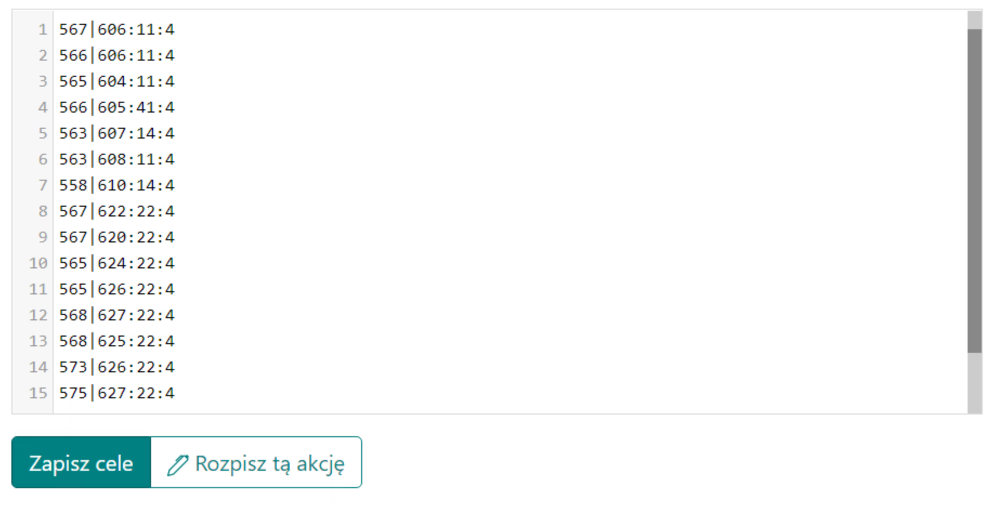

# Large Outlines - Guide

Note, the idea for large actions presented below is not mandatory, it can be done in any way.

In this guide, you will see how to most effectively and efficiently plan a large action, ultimately in the late stage of the world, for more/much more than 100 targets, where only full offs are taken into account during the action in the tribe. Note, it is assumed that you already have all the knowledge from [First Steps with the Planer](./../first_steps/index.md)! and it is recommended to first read the two short previous guides in this section, namely [How to Enter and Save Action Targets](./two_regions_of_the_tribe.md) and [Two Regions of the Tribe: What is Front and Rear](./two_regions_of_the_tribe.md).

!!! hint

    Always start planning any action on this page by counting all the offs and dividing them into Front and Rear according to the spirit of the given plan. For this purpose, use tab 1. Available Units, and the results are presented in the table under the targets.

We will plan the action using automatic planning due to the number of targets and will use all available advanced options. We will not use manual target editing options; the entire action from A-Z will be created in the first tab, then only set the entry times and send the ready targets.

For a large action, the completed tab may look as follows:

{ width="600" }

Set the minimum number in the off to a full off, about 19k or slightly less if the planned sends are in a few days and the offs will have time to fully develop by then (only offs above this will be shown in the table), the distance from the front line to about 10-45 depending on what the front looks like. If the opponent has diodes in the tribe's territory, exclude them by pasting them into the field Not Considered When Counting Front Offs. Click Save and Refresh Available. The table with the number of our offs will be completed.

The completed table should look something like this:

{ width="600" }

Note, the two bottom rows of the table will only appear after we complete the targets, as the quantities entered there depend on what targets are saved (the offs and nobility are counted around them). Hence, at the beginning, there will be zeros there. You can proceed to enter targets depending on the number of offs and nobility you have. Then you can recount Available Units.

Example of entered targets:

{ width="600" }

If some targets need different settings from the default ones, use the extended coding of offs and nobility described in the article How to Enter and Save Action Targets. Then go to tab 3. Plan Parameters to set the settings for this plan, a detailed description of all options in case of difficulties can be found in the topic dedicated to it, i.e., 3. Plan Parameters.

Example settings for a large action:

{ width="600" }

Additionally, you can set morale in [tab 4](./../advanced/4_morale.md).

The last thing you should consider is [tab 5: Avoiding Night Bonus Sends](./../advanced/5_avoid_night_bonus.md), it will probably be beneficial, at least for the players and their health, due to the reduced number or elimination of sends in the middle of the night :)

After entering all the targets, changing the action settings, and possibly the night bonus, proceed to the next part of the plan by clicking Plan this Action, then check if everything is OK and possibly return with the Back button, change the settings. Then, as usual, go to the Times tab, set the entry times, finish the plan, and send the targets to the players.